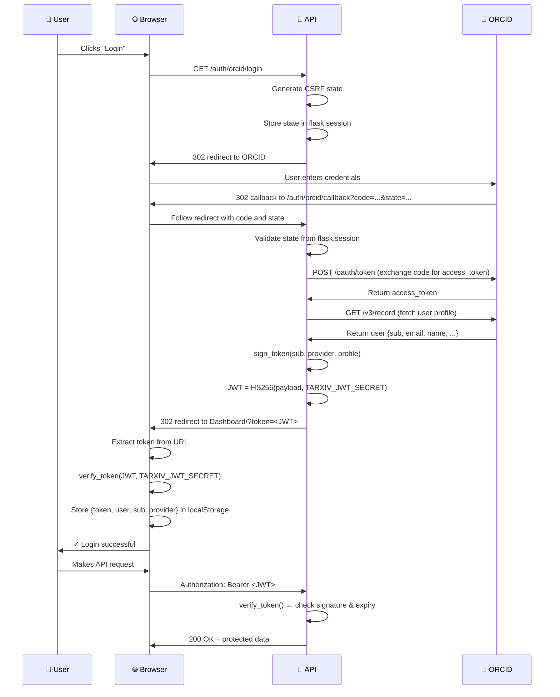
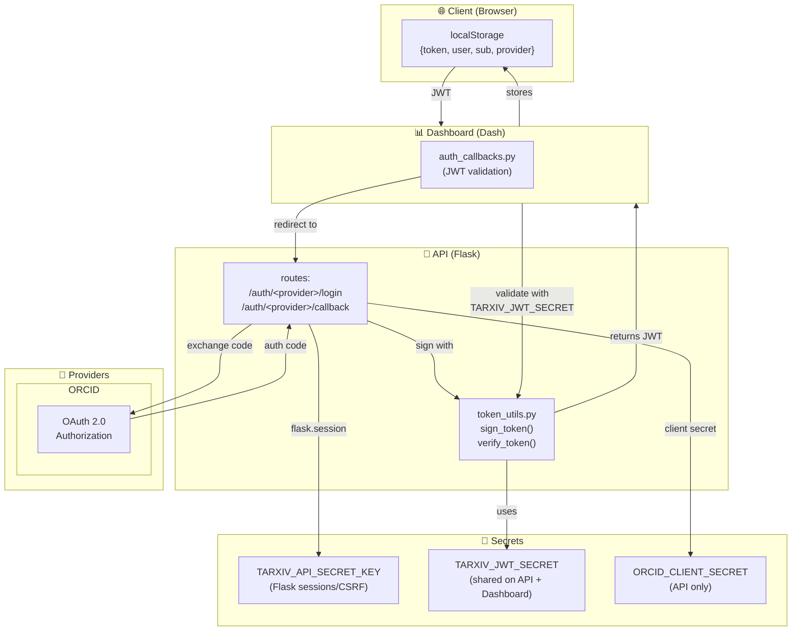
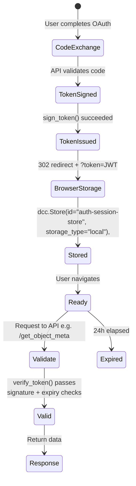

# TarXiv Authentication

TarXiv uses OAuth 2.0 for user authentication. All OAuth logic lives in the API service (`tarxiv/api.py`). The dashboard is a thin client that redirects to the API, receives a signed JWT, and stores it locally.

## Architecture

```
User clicks Login
  → browser: window.location.href = "<API_URL>/auth/orcid/login"
  → API: generates CSRF state, stores in flask.session, 302 → identity provider
  → Provider: authenticates user, 302 → <API_URL>/auth/<provider>/callback?code=...&state=...
  → API: validates state, exchanges code, normalises profile, signs TarXiv JWT
  → API: 302 → <DASHBOARD_URL>/?token=<jwt>
  → Dashboard: validates JWT signature, stores {token, user, sub, provider} in localStorage
  → All API requests: Authorization: Bearer <jwt>
  → API: verify_token() checks signature + expiry on every protected endpoint
```

### Key design decisions

- **Credentials are API-only.** `ORCID_CLIENT_ID` and `ORCID_CLIENT_SECRET` are set only on the API container. The dashboard never sees them.
- **Flat module structure, no inheritance.** Each provider is a plain Python module implementing two functions. Adding a provider means creating one file and one registry entry — nothing else changes.
- **JWT contains the full profile.** No database round-trip is needed to render the user's name or serve a request. The JWT payload is the source of truth for the session lifetime.
- **`storage_type="local"` on the dashboard.** The JWT persists across page reloads and browser restarts. Expiry (`exp` claim, 24 h default) is checked on load; expired tokens clear the store and return the user to the login screen.

---

## Module layout

```
tarxiv/auth/
    __init__.py          — exports: ORCIDAuthClient, sign_token, verify_token, PROVIDERS
    token_utils.py       — sign_token() and verify_token() using PyJWT + TARXIV_JWT_SECRET
    orcid_client.py      — legacy dashboard helper (kept for backward compatibility)
    providers/
        __init__.py      — PROVIDERS registry: {"orcid": orcid_module, ...}
        orcid.py         — ORCID provider: build_authorize_url(), complete_login()
```

---

## JWT payload

| Claim | Example | Notes |
|---|---|---|
| `sub` | `"0000-0002-1825-0097"` | Stable provider-issued ID; use as foreign key in future user tables |
| `provider` | `"orcid"` | Which identity provider authenticated this user |
| `iat` | `1741305600` | Unix timestamp — issued at |
| `exp` | `1741392000` | Unix timestamp — expires at (`iat + 86400` by default) |
| `profile` | `{username, email, forename, surname, institution, bio, ...}` | Normalised `ProfileRow` dict |

Algorithm: `HS256`. Secret: `TARXIV_JWT_SECRET` environment variable (must be identical on API and dashboard).

---

## Environment variables

**API service** (`tarxiv-api`):

| Variable | Description |
|---|---|
| `TARXIV_JWT_SECRET` | Shared secret for signing and verifying JWTs. Must also be set on the dashboard. |
| `TARXIV_API_SECRET_KEY` | Flask session secret key (used for CSRF state). If unset, a random key is generated at startup (sessions will not survive restarts). |
| `TARXIV_DASHBOARD_URL` | Full URL of the dashboard, e.g. `https://tarxiv.com`. Used to construct the post-login redirect. |
| `ORCID_CLIENT_ID` | ORCID developer app client ID. |
| `ORCID_CLIENT_SECRET` | ORCID developer app client secret. |
| `TARXIV_ORCID_REDIRECT_URI` | Must be set to `<API_URL>/auth/orcid/callback` and registered in the ORCID developer app. |
| `ORCID_AUTH_URL` | Optional. Defaults to ORCID sandbox (`https://sandbox.orcid.org/oauth/authorize`). |
| `ORCID_TOKEN_URL` | Optional. Defaults to ORCID sandbox token endpoint. |
| `ORCID_API_BASE` | Optional. Defaults to ORCID sandbox API base. |

**Dashboard service** (`tarxiv-dashboard`):

| Variable | Description |
|---|---|
| `TARXIV_JWT_SECRET` | Same shared secret as above — used to verify incoming JWTs. |
| `TARXIV_DASHBOARD_API_URL` | Full URL of the API, e.g. `https://api.tarxiv.com`. Used to construct the login redirect link. |

---

## Diagrams

### Auth Sequence



### Data Flow & Secrets



### JWT Lifecycle



TODO: Should probably add facility to delete expired cookies. Does browser do this? What about is storage moves to `dcc.Store()` which should happen soon inline with user's remember me policy.

## Adding a new authentication provider

The steps below use a hypothetical Google provider as an example.

### 1. Register a developer application

Create an OAuth 2.0 application with the new identity provider. The redirect URI to register is:

```
<API_URL>/auth/google/callback
```

Note the client ID and client secret.

### 2. Create `tarxiv/auth/providers/google.py`

The module must implement two functions:

```python
def build_authorize_url(state: str) -> str:
    """Return the provider's OAuth authorization URL."""
    ...

def complete_login(code: str) -> dict:
    """Exchange the authorization code for a normalised user profile.

    Returns
    -------
    dict with keys:
        sub      — stable, provider-issued unique user identifier (str)
        provider — name of this provider, e.g. "google" (str)
        profile  — normalised dict compatible with ProfileRow fields:
                   id, provider_user_id, email, username, nickname,
                   picture_url, forename, surname, institution, bio
    """
    ...
```

`build_authorize_url` should read its credentials from environment variables (e.g. `GOOGLE_CLIENT_ID`, `TARXIV_GOOGLE_REDIRECT_URI`) via a helper that raises `RuntimeError` if any are missing — this surfaces misconfigurations clearly at startup rather than at login time.

`complete_login` should:
1. Exchange the `code` for an access token at the provider's token endpoint
2. Use the access token to fetch the user's profile from the provider's API
3. Extract and normalise the profile fields into the dict structure above

### 3. Register the provider

Add one line to `tarxiv/auth/providers/__init__.py`:

```python
from . import orcid
from . import google          # add this

PROVIDERS = {
    "orcid": AuthProvider(
        build_authorize_url=orcid.build_authorize_url,
        complete_login=orcid.complete_login,
    ),
    "google": AuthProvider( # add this
        build_authorize_url=google.build_authorize_url,
        complete_login=google.complete_login,
    )
}
```

### 4. Set environment variables on the API container

Add the provider credentials to `setup/docker-compose.yml` under `tarxiv-api`:

```yaml
GOOGLE_CLIENT_ID: ${GOOGLE_CLIENT_ID:-}
GOOGLE_CLIENT_SECRET: ${GOOGLE_CLIENT_SECRET:-}
TARXIV_GOOGLE_REDIRECT_URI: ${TARXIV_GOOGLE_REDIRECT_URI:-}
```

### 5. Add a login button on the dashboard

The dashboard login button currently triggers `window.location.href = "<API_URL>/auth/orcid/login"`. To support an additional provider, add a second button that navigates to `<API_URL>/auth/google/login`. The callback handling in `auth_callbacks.py` is provider-agnostic — it reads `?token=<jwt>` regardless of which provider issued it.

### 6. Verify

- Navigate to `<API_URL>/auth/google/login` — confirm browser redirects to Google
- Complete authentication — confirm browser lands on `<DASHBOARD_URL>/?token=...`
- Confirm the success banner appears and the user chip populates
- Inspect the JWT payload (e.g. via [jwt.io](https://jwt.io)) and confirm `provider` is `"google"` and `sub` is the Google user ID
